This is merely my oversimplified takeaways/keynotes on the [Alberto Brandolini ebook on event storming ebook](https://leanpub.com/introducing_eventstorming), I stongly recommend reading the eBook.  

## Introduction

The way we think usually about **design** is around **state of the data structure** (such as the *state of an 'Order' with a set of properties*) which we save into the **database** so we could retrieve it on demand. It always represents the **last data structure state** (or **snapshot**) of an **object**.

>> This approach is called sometimes **data driven approach**. 

**Event storming** takes us into the next level, we are **modeling chronology of events**, or **events timeline** of the **business processes behavior** were the **state of data structure** is the **sum** of all **events** that **happens** up until a certain **moment** in time. 

Simply put, what are the **changes** (or **state transitions** **history** of an **object**) that **occurs** up until the **moment** we get into the **current state**.

>> what are the changes that happen and cause us to get where we are right now?

As a result, the **last state of the data structure/properties** is just a matter of **finding** the **last events** and playing back all chronological sequence of **events** that occurs until the **last events**, the *other way around is not possible*.

**Events** are the best candidate for **ubiquitous language**, **business** is speaking in **domain events**, **policies** and **peoples** are **reacting** when **something happens** **not** because some **information** is in the **database**.

## Big Picture

The **Big Picture EventStorming** will deliver the **snapshot** of our **current collective level of understanding** of the **business** including **holes** and **gaps**.

The **purpose** of this step is to keep **everything visible on the board** using **notations**, the first trick to make sure that we don't talk about **invisible things** (no side discussion!). 

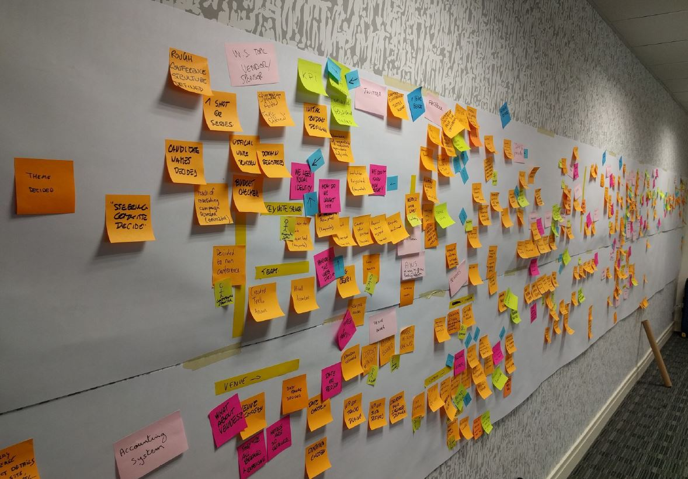

The **Big Picture** is an **on-boarding process** of workshop sequences which relies on **incremental notation** and **visible legend**.

The **goal** is a **representation** of our **current understanding** of the **systems**, including **inconsistencies** and **holes**.

### Pretending to solve the problem by writing software
--------------------------------------------------------
**The Software Development fallacy**

Dan North said **Software development is a learning process, working code is a side effect, It's not the typing, it's the understanding that matters**. 

Being **learners** instead of **builders** isn't that easy. Talented developers are often **compulsive learners**. **Curiosity** is their main driver, and they take **pride** in **solving** the **puzzle**. However, putting learning at the centers of everything isn't as actionable as we'd like.

The **value** for the **company** is not in the **software** itself, it's the company **ability** to **leverage** the **software** in order to **deliver value**.

The problem with **programmers** striving to do a **good job**, is that for the vast majority of them, they have **no experience** of what a **good job looks like**.

Software engineers have been tried **modeling enterprise application** looking for relevant **nouns**. **Nouns** are in fact the **portion** of the **enterprise knowledge** which is more prone to **ambiguity**. Remember **silos**? Try asking: "Do you know what an Order is?" to different department like **Sales**, **Packaging**, **Shipping**, **Billing**, or **Customer Care**.

- In **Sales**, a salesperson will open a draft order, add and remove items, and apply discounts. Then place the order once she has the customer agreement. 

- In **Packaging**, a warehouse clerk will pick items from the shelves, eventually updating their availability and reporting missing items in case of surprises. Once finished, the clerk will seal the package, and declare it ready for shipment.

- In **Shipping**, one or more deliveries will be planned for the given order. The order is fulfilled once all the items are delivered. 

- In **Billing**, we'll send and invoice for the order according to our billing **policy**, such as 50% open placing the order and 50% after order delivered. 

- In **Claims**, customers are opening a claim about a received order, if something didn't match the expectations: broken or missing items, and so on. Of course a claim can be opened only if you're the customer that placed the order, and only about the items included in the order.

**The Product Owner fallacy**

**Software development** is mostly a **learning** endeavor, Scrum places a lot of **responsibility** upon the shoulders of the **Product Owner**, who serves as the primary interface between the team and the business stakeholder. Often, **teams** are kept in **isolation** because the PO is taking care of all the necessary **conversations** with different **stakeholders**.

Slowly, the Product Owner becomes the only person who's entitled of learning, while the development teams turns into a mere translation of requirements into code. Everything starts to smell like the old Analysts vs Developers segregation that was so popular in Waterfall-like environment. 

But if we think software development as learning, it suddenly becomes obvious that second-hand learning is not the best way to learn. If your goal is to learn to ride a bike you can choose between:

- get a bike and try it,

- talk with a biker first,

- talk with a friend that knows a biker,

- read a specification document written by a friend that talked with a biker.

*Choice is yours.*

**Single point** of **failures** is bad, i.e. placing the **burden of understanding** the whole **system** on a **single person/role** sounds like a terrible idea even in **strategic terms**.

What *Scrum really pointed out was that a development team is very bad at managing conflicting priorities*, and it's a *Product Owner responsibility to sort them out* before the development iteration takes place. *What Scrum didn't prescribe is that all the learning should happen through the product owner*. This is a dysfunction that lowers the quality of the overall learning and of the resulting product.

**The backlog fallacy**

**Iterations** are supposed to be a good thing. The backlogs provide the illusion of the **whole project** is just the sum of its parts, which, unfortunately, isn't the case. 

A **backlog** is optimized for delivery. Having a **cadence and releasing** in small increments works great in order to provide a heartbeat and a measurable delivery progress. But a cadence in which every week repeats the same old basic schema of the previous one, with planning, implementation, and then release may not leave **enough space** for those **activities** that don't follow the plan. 

In fact, some project follow the plan relatively well. They're usually the project where there's not that much of **discovery** to happen. **Compliance** projects are a typical example: a new **regulation** mandates certain requirements and we just have to deal with a **checklist**.

This **habits** is a **burden towards development of meaningful products**. Unconventional activities like *'going on the field to see how users are really using our software'*, or *'running a large scale workshop in order to better understand the problem that our software is supposed to solve'*, simply don't happen, because there's always something more important, already planned for the week. Repeating things week after week is boring and Boredom is the arch enemy of learning.

*Optimized planning and delivery* isn't really optimized for discovery. In fact discovery is more likely to happen when we break **our habits** and do something **distinctively different**.

**Domain-Driven Design**

**Domain-Driven Design** focused on **language** as the **key tool** for a deep understanding of a given domain's complexity, it doesn't assume **consistency of the different areas of expertise's**. In fact, it states that **consistency** can only be achieved at a **model level**, and that this **model can't be large**.

When **modeling large scale system**, we shouldn't aim for a large **enterprise model**. That's an attractor for **ambiguities and contradictions**. Instead we **should aim for**:

- **Multiple**, **relatively small models** with a high degree of **semantic consistency**, 

- a way to make those **interdependent models** **work together**.

A small, strongly **semantically consistent model** is called **Bounded Context** in Domain-Driven Design.

**The EventStorming approach**

There's a connection between the different highlighted problems. If you remove the context from the picture it all boils down to a very few distinguished things:

1. See the **system as a whole**.

2. Find a problem **worth solving**.

3. Gather the best immediately **available information**.

4. Start implementing a solution from the **best** possible **starting point**.

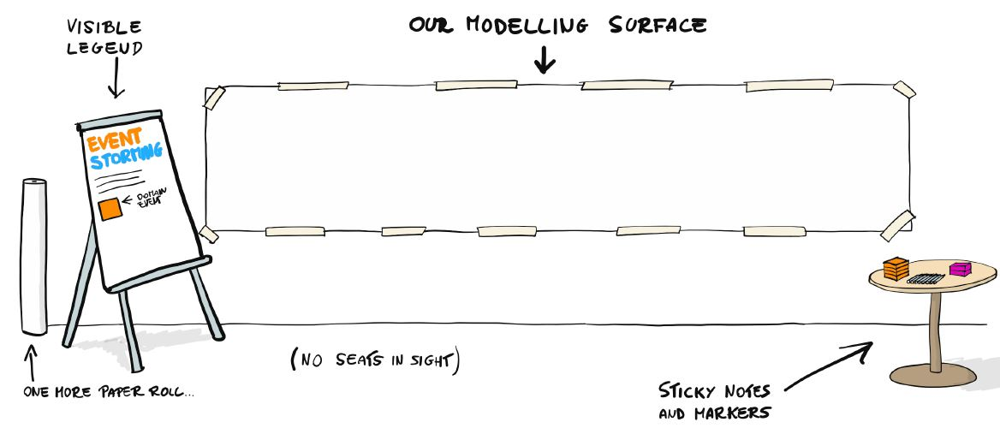

**EventStorming setup** :

- Gather all the key people in the same room and build together a model of the current understanding of the system

- Find a room with enough space for people to move with long straight wall where our paper roll can be placed as our modeling surface

- Plenty of sticky notes and markers 

- Timer: phases will need to be time-boxed.

- Leverage the idea of incremental notation to keep the workshop in a perennial "Goldilocks state".

### Running a Big Picture Workshop

#### Domain events
--------------------------------------------------------
*There's no implicit filter on the source, No implicit scope limitation*.

We use a **verb at past tense** to describe events which forces us to explore the whole domain with the focus on **state transitions** (when something changes).

They can happen for different reasons :

- consequence of some **User Initiated Action**

- coming from some **external system**

- the result of **time passing**

- direct consequence of **some other event**.

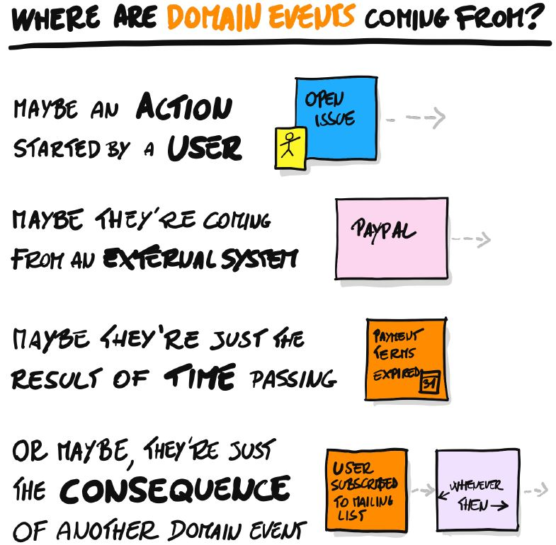

**Example**

collect temperature information from an external system, a first **Domain Event** candidate might be **Temperature Raised**. A closer look, we might need to have a combination of **Temperature Registered** from an external source and a **Temperature increment measured** as a consequence, and realize that the initial writing, despite being correct, was actually not closer to system design but it fine because we don't need make it precise too early (*Embrace Fuzziness* at this stage).

**Why Domain events ?**

- **Domain Events** are easy enough to be grasped by everyone, No previous experience required.

- **Domain Events** are precise enough to remove a whole lot of ambiguities from the conversation.

- **Domain Events** are meaningful, by definition. If no one cares about a sticky note, maybe it's not that relevant in the system.

- **Domain Events** represent state transitions to which reactive logic can be attached (**Policies**). 

- **Domain Events** can point us towards the bottleneck of our current flow, e.g. probably the most relevant problem to solve.

- **Domain Events** can support different narratives and modeling techniques such as conversations from very different backgrounds can sparkle from the very same model.

- **Domain Events** are triggers for consequences

### Commands
--------------------------------------------------------
They are key ingredient for user interaction (**Commands** - Actions - Decisions) or the result of a **user decision** (which might have required some sophisticated thinking) and are the trigger of some computation on the other side. If we focus on human behavior, we might see them as some action that a user is performing, like registering on a system or placing an order. If we focus on system implementation instead, they can represent a command we've just received, and the system has to fulfill.

### Hotspot
when getting sucked into a discussion that we're not able to finish, we use a Hotspot notation so we will come back to it in the next session.

### Discovering Bounded Contexts with EventStorming
--------------------------------------------------------
Ideally, a **bounded context** should contain a **model tailored around a specific purpose**: the perfectly **shaped tool** for one **specific job**, **no trade-offs**.

>> **Not accepting** a multiple languages that forms an **inconsistent whole** is so bad, that we might end up putting **same objects** that have **different semantics** across **boundaries** in the **same box**, and try to figure out how to **distinguish** them, which becomes our problem, because **business** don't have **ambiguities** within a **boundary**. Therefore, we will have no **empathy** from the **business** because we are solving a problem that they don't have.

Whenever we realize a different **purpose is emerging**, we should give a chance to a **new model**, fitting the **new purpose**,and then find the best way to allow the **two models interact**.

> It's the job of **software architects** to discover **boundaries** in our domain, and this will be more an investigation on a crime scene than a tick-the-checkboxes conversation.

#### 1. Chaotic Exploration
--------------------------------------------------------
with **no timeline** participants explore the domain, writing **verbs at past tense** on sticky notes, nobody knows the whole story

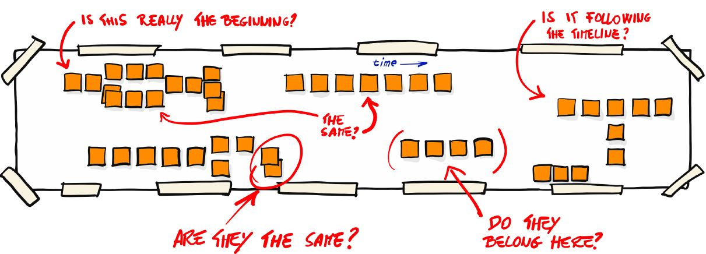

As a result, we'll end up with a **lot of duplicated sticky notes** (e.g. schedule Ready, Schedule Completed, Schedule
Published), or apparently duplicated ones in unordered manner. It's usually a good idea to **resist the temptation** to resolve those **duplicates** because they may refer to **different Bounded Context**.

#### 2. Enforce the Timeline
--------------------------------------------------------
**Consistent timeline** describes the **business flow** from a beginning to an end with **parallel** and **alternative paths** to explore. The need to come up with one consistent view of the entire business triggers conversations around the places where this view is not consistent, we get an answer from the experts who are available!.

We get to a highlighted conversation with a Hot Spot (not solve everything yet) to let the exploration flow and address it later on.

The **participants** often look for a more **sophisticated emerging structures**. **Pivotal Events and Swimlanes** are **strategies** to make the **emerging structure visible** and discover **bounded contexts**.

**Pivotal Events**

They mark a **transition** between **different business phases**. once highlighting **pivotal events**, sorting becomes a lot faster inside the **boundaries**, and a more **sophisticated structure** starts to emerge.

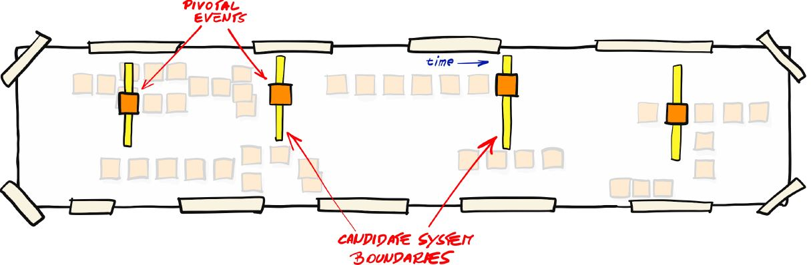

**Swimlanes**

Horizontal **Swimlanes** is a common way to structure portions of the whole **flow** (usually happens after **pivotal events**).
Even in the most straightforward businesses the flow is not linear. There are **branches**, **loops** and things that happen in **parallel** (e.g. **billing** getting triggered only around the **events** of a **sale**, or maybe a **cancellation**).  

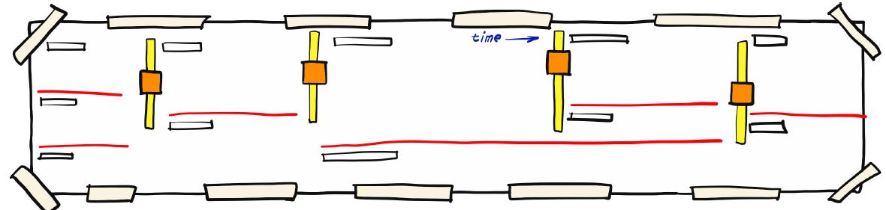

Pivotal Events and Swimlanes provide an emergent structure on top of the flow of Domain Events.

#### 3. People and Systems
--------------------------------------------------------
we explore the **surroundings of our business**, explicitly looking for **people: actors, users, personas, or specific roles** in our **system**. Visualizing different **people** (actors) in our system helps to dig into the **different perspectives**. We might discover **specific responsibilities** and **roles**, or differing perceptions. 

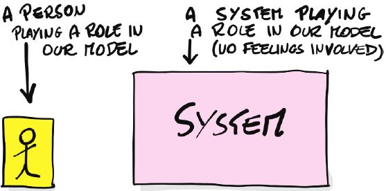

e.g. in a conference superstar guest, invited as a keynote speaker, an expert or a newbie are different, i.e. exploration phase may end up in opening an entirely new branch or making different strategies more visible and readable where systems usually trigger a different type of reasoning making the boundaries explicit.

#### 4. Explicit Walk-through
--------------------------------------------------------
To validate the **discoveries**, a picked **narrator** trying to tell the **whole story**, from **left to right**. Consistent **storytelling** is hard, in the beginning, because the **narrators' brain** will be torn apart by **conflicting needs**. Narrators will try to tell the story using the **existing events as building blocks**, but at the same time, they'll realize that what seemed good enough in the **previous reviews** is not good enough for a **public on stage storytelling session**.

Usually, our model needs to be **improved**, to support **storytelling**. More **events** will appear, others will be moved away, paths will be split and so on. Participants are often challenging the narrator and the proposed **storytelling**, eventually providing examples of corner cases and not-so-exceptional-exceptions.

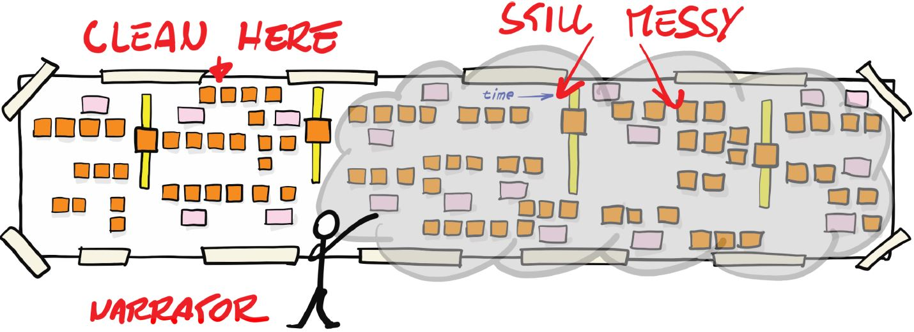

The more we progress along the timeline, the more clarity is provided to the flow, while the narrator is progressing like a defrag cursor.

**Extra steps**

few extra steps may provide more insights :
- **explore** the **value** that is supposed to be **generated or destroyed** in the **business flow** (*money, time, reputation, emotional safety, stress, happiness*, and so on).

- explore **problems and opportunities** : signal issues that didn't surface during the previous steps

- **challenge** the **status quo** with an **alternative flow** : given the current situation, what happens if we change it? Which parts are going to stay the same and which ones are going to be radically changed or dismissed?

- **vote** the most **important issue** to leverage the **clarity** of **collective understanding** into political momentum to do the right thing

> There's a lot of **Bounded Context** related **information** that comes as a **byproduct** of our **discussion**

**Heuristic: look at the business phases**

Businesses grow around a well-defined **business transaction** where some **value** — usually money — is traded for something else. **Pivotal events** have a fundamental role in this **flow**.

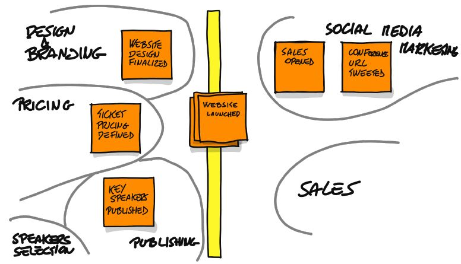

> **boundary events** are also the ones with different **conflicting** wordings, the **perception** of **bounded contexts** usually **overlaps**. A key recommendation here is that we **don't have to agree on the language!** There's much more to **discover** by making **disagreements** **visible**.

> when two **models** are **interacting**, there are usually **three models involved**: the **internals**, the **two bounded contexts** and the **communication model** used to **exchange information** between them.

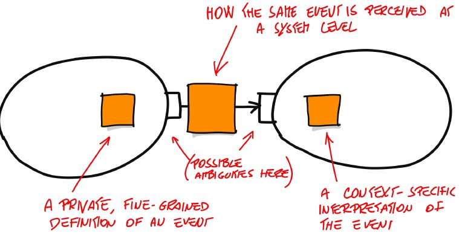

> **Pivotal Events** are usually part of a more general **published language** **shared** between the different **parties**.

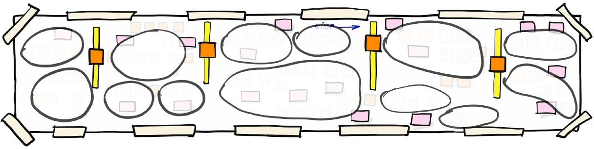

Emerging bounded contexts after a Big Picture EventStorming. 

**Heuristic: look at the swimlanes**

**Swimlanes** often show **different paths** that involve **different models**, **Not** every **swimlane** is a **Bounded Context**, sometimes they're just an **if statement** somewhere, but when swimlanes are **emerging** for the **need** to highlight an **independent process**, possibly on a **different timeline**, then we might want to give a **shot** to an **independent model**.

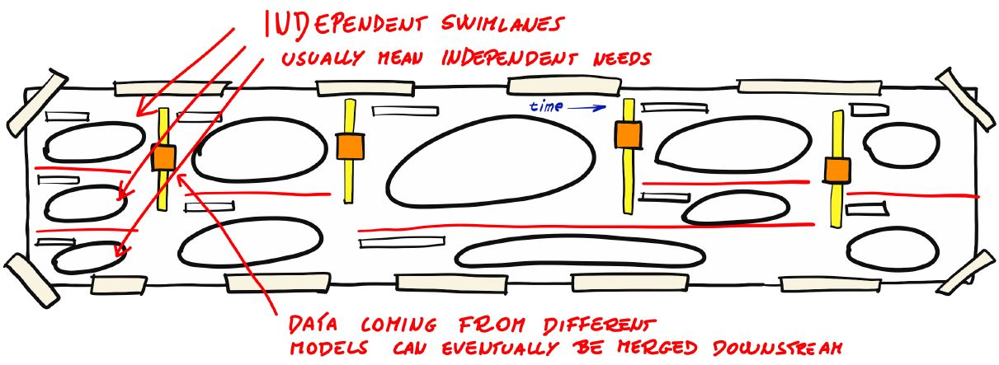

**Swimlanes** are usually a **reliable clue** for possible different **bounded contexts**

**Heuristic: look at the people on the paper roll**

An interesting twist might happen when dealing with **different personas**. Apparently, the **flow** should be the **same**, but it's **not**.

as an example, **Conference organizers** or **track hosts** can invite some speakers, while others submit their proposals in the **Call for Papers**. The **flows** can be **independent** in the **upstream part** of the flow (skip review process for a **superstar speaker**). Downstream they're probably not (on the *conference schedule* we want the same data, regardless of how we got it).

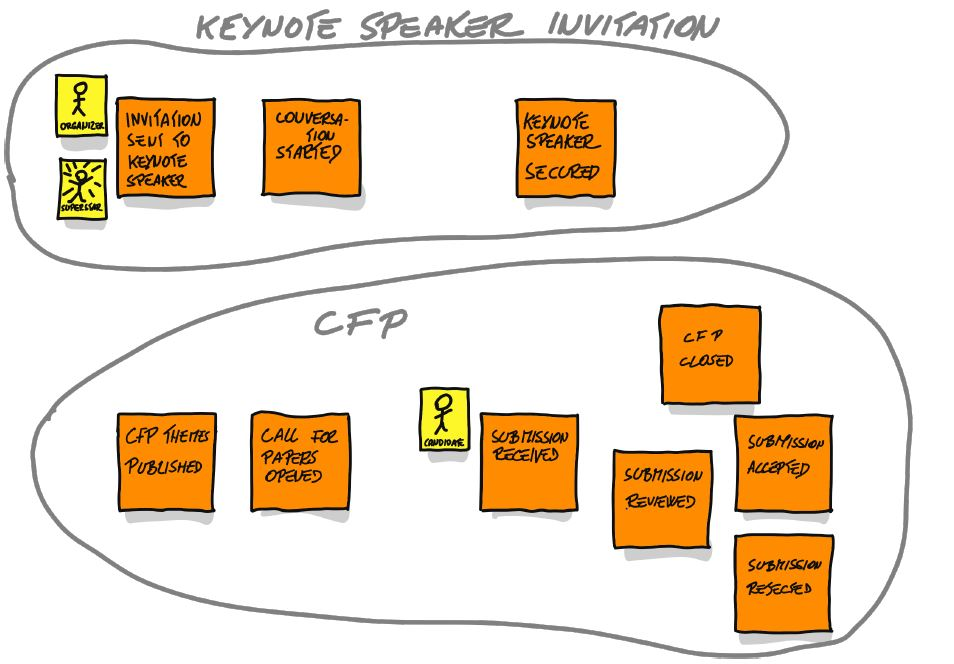

Two **parallel flows** may require **independent models**, we shouldn't think in terms of **roles**: they'll recognize that *speakers* and *keynote speakers* are **different** in the **left part** of the **flow**, but they'll have a **similar** **badge** during the **registration process**, and they won't be different from **regular attendees** during **lunchtime**, when their role would be a simple mouth to feed.
 
**Heuristic: look at the humans in the room**

**People** are during the **exploration** is probably giving the simplest and powerful **clue** about **different model distribution**, **Experts** tend to spend most time **hovering** around the **areas** that they **know better** to provide answers or to correct wrong stickies, Alternatively, they **comment** around the **areas** that they care about, maybe because the current **implementation** is far from **satisfactory**.

>> Different people are a great indicator of different needs, which means different models often be remembered, through some weird spatial memory.

**Heuristic: look at the body language**

**body language** can be another source of information, not every **dissent** can be **verbal**, shaking **heads**, or **eyes rolling** are a clue of **conflicting perspectives** that haven't been **addressed**, different **hierarchy levels** come to different **views** on apparently the same **problem**.

A typical **conversational pattern** often happening around **pivotal** or **boundary events**.

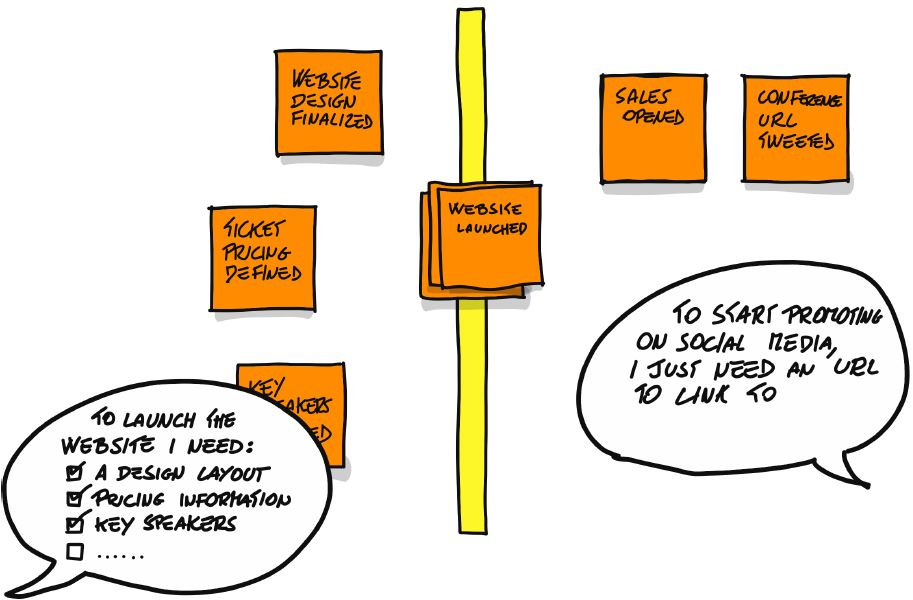

typical **competence clash**, the **persons** on the **left** usually **know** all the **mechanics involved** in a given step, while the ones on the **right** only care about the **outcome**.

**Heuristic: listen to the actual language**

If you look for central **terms** like **Talk**, you'll discover that they're used in many
different places :

- **A Talk** can be **submitted**, **accepted** or **rejected** in the **call for papers**.

- **A Talk** can be **scheduled** in a given slot, of a given track.

- **A Talk** can be **assigned** to a given **presenter or staff member**, to introduce the speaker.

- **A Talk** can be **rated** by attendees.

- **A Talk** can be **filmed** and **recorded**.

- **A Talk** can be **published** on the conference **YouTube** channel.

we're not talking about the same **Talk!**, we're talking about **different models** in **selection**, **scheduling**, **staffing**, etc.

## Modelling processes and services

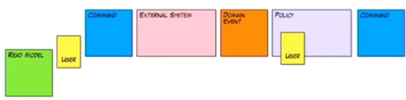

Color puzzle thinking

### Process Modeling as a cooperative game
--------------------------------------------
Here we need a **different** type of **interaction** in the **solution space**: **exploration** will progressively **blend** into a more **structured process** of **collaborative modeling** to **factor** **individual contributions** into a **shared solution**. The solution requires **different dynamics** and ultimately **reaching an agreement**:

- designing a **new business process**, maybe on top of an **existing** one

- addressing **relevant problem** which deserves our attention

- dealing with a **limited scope**: focusing on a single **end-to-end process**

- talk to smaller number of **people**, usually with **different backgrounds**, **collaborating** towards a **solution**.

- not designing software yet at this stage

Here we use a **cooperative games** where **players** are not **competing** against each other, but **cooperating** towards a common **goal**. We still have to **win**, but the opponent is **"the problem"**, not another **human** being to be **defeated**.

To unlock the **team's potential** we have to give up our **technical** specialized **jargon** which create **invisible barriers** that **prevent** other **people** from joining a **collaborative** session.. 

We **win** at the EventStorming **process modeling** game when:

- All **process paths** are **completed**, leading to a **stable state** where no **immediate action** is required.

- **Notations** are preserved, with no **holes** or **gaps**

- Every possible **Hotspot** is **addressed**

- All the **stakeholders** involved in the process are **reasonably happy**

**Business processes** are never just a **sequence of steps**, they carry the possibility of **alternatives and variations**, Some of these **alternative paths** will eventually merge into the **mainstream**, while others will **terminate** with different **exit conditions**. 

**register a new user on a website**

- *user e-mail* address to be already in the system

- An *on-line purchase* will need different *paths* for different *payment methods*

- An inquiry on a *past purchase* will be handled *differently* if the purchase is ten minutes, ten days or ten years old, and so on

- *trigger* a few other actions, like the opening of a *virtual account* in the background, or some *background checks* on the customer, adding the *new user to a mailing list* and so on

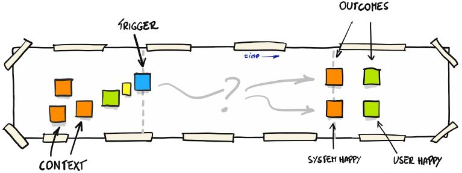

We're expecting processes to start from a given **trigger** (usually a **Command** or an external **Event**), and to finish with a combination of **Events** and **Read Models**.

The reason for the apparent duplication is termination **events** are putting the **system** in a **stable state**, but human users usually need to see the **outcome** somewhere, to **perceive** the **process** as **complete** (process exposes something like a repeating).

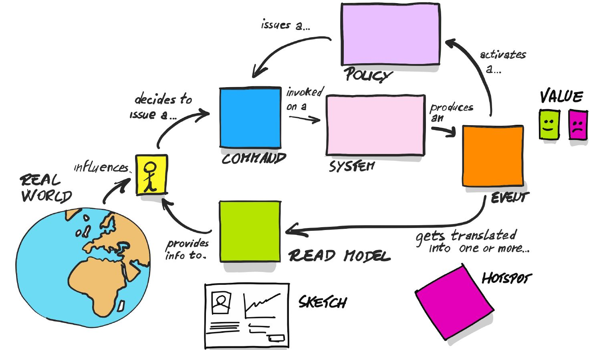
Color Based Grammar which is a good summary of the **basic building blocks** needed during a **process modeling** session

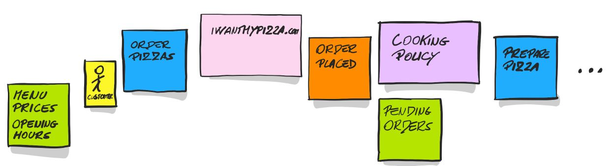

The **linearized version** (better fits modeling on a **paper roll and event-based** storytelling approach), with the beginning of the pizza example process, tailored around our simple pizza delivery example, with the beginning of an order processing flow.

>> note that the "cooking **policy**" is located between the "OrderPlaced" **Event** and "PreparePizza" **command**.

>> use **Hotspots** to visualize **dissent**, **objections**, and **issues** that we should not **address immediately**.

> This flow overlooks scenarios like *'order cancellation'* or *'customer refund'* which are part of **nontrivial business domains**, and have to be designed and managed accordingly.

### Process Modeling Building Blocks
-------------------------------------
**Process Modeling** can happen more **frequently**, making the need to skip **precision** which will be **gradually introduced** later on.

**Less precise** **conversational** approach should allow the **team** to **sketch** the **process baseline quickly**, **exact semantic** could be a **barrier** which lead into an **exclusive conversation**, a more **conversation-friendly** make everything **visible quickly**. 

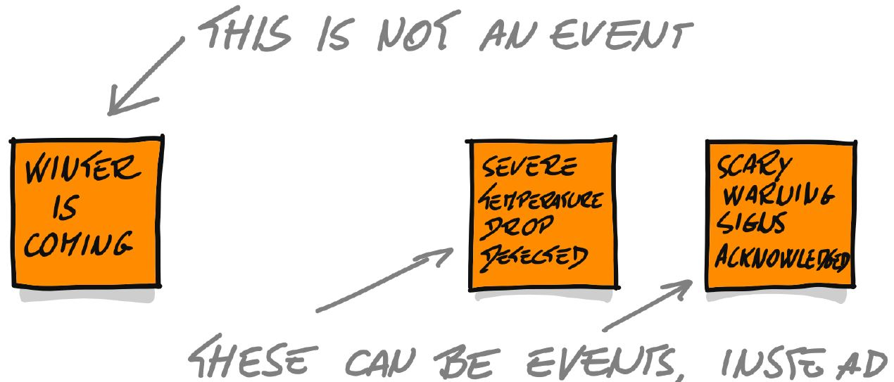

**Events** will be the building **blocks** of our **storytelling**, we are building a **objection-proof business process**, we'll need to be a little more **formal**. We need to **rephrase** some **events**, which will need to be **state transitions**, and during process modeling and software design sessions, the **phrasing** will be strictly **mandatory**. Different rounds will increase **semantic precision**, and probably require more **events**.

#### Events from user interaction

**Events** may be the result of some **user interaction** with a system, a **single user interaction** can trigger multiple **events** with many **alternative outcomes**. They also could be a result of different level of **granularities** or **perspectives**.

>> Keep in mind that different **perspective** can suggest different **naming** for the same **event** (i.e. use **Hospots** and ask the question : aren't they the same or not?).

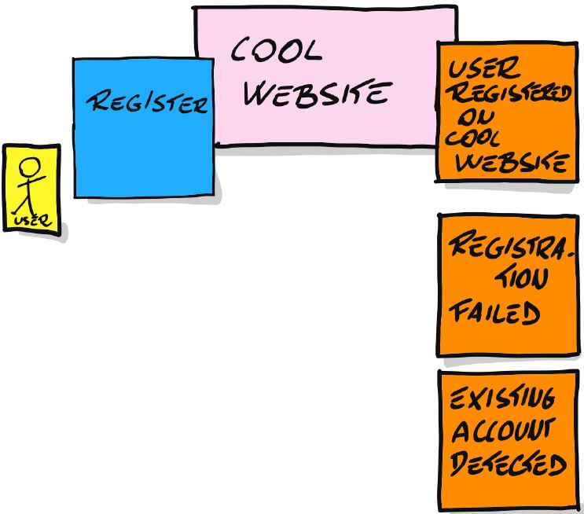

An **emergent pattern** in this situation is to position the **happy path** on **top** and less frequent **alternatives** below

#### External Systems
**External Systems** can trigger **events**. A typical example occurs when you have distributed **sensors** somewhere: something like *'Temperature registered'* or *'Perimeter violation detected'*, or when you simply don't want to *investigate* more *in-depth* on the **event origin**.

#### Time-triggered events

**Time** could be considered as a particular **category** of an **external system**, but time is so pervasive than visualizing it everywhere can end up **cluttering** our **model** more the **necessary**.

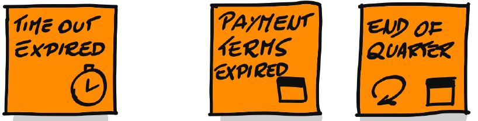

We can **discover** that the actual **mechanics** are a lot more **complicated**, such as **organization performance review** per **department** with buffer to *'allow last-minute corrections pending paperwork to be completed'* and so on, a little **process** like **waiting** for every **department** to **finish** their **homework**, with a **department** may be **unrecoverably late** we will declare the *'quarter closed'* anyway.

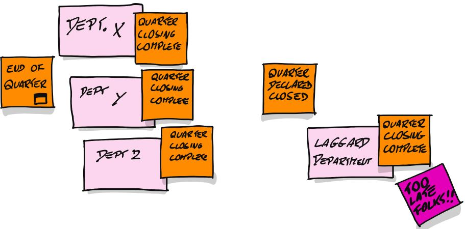

> We are still missing some building **blocks** to tell the **story**, **Policies** will play a key role in visualizing a trickier **process** like this one.

####  Events which are not happening

we consider **events** to be **state transitions** in this case is hard to **model**, but consider the example a birthday of a friend and we didn't forget to greet him, we can observe from the outside is that a day has passed without receiving any greetings. i.e. the event **'End of day'** happened before the **'Greeting received'** event.

#### Cascading reactions

**Events** appear sometimes to be the **direct consequence** of other **events**, something like *whenever this happens then that happens*, sometimes the **overlapping** between the **events** is so **tight** that it's hard to **distinguish** the two(*two faces of the same coin*).

There is no such thing as an **implicit cascading reaction**, we'll try to make the connection **visible** by adding a **policy** and a few other **notation** in between.

#### Commands, Actions or Intentions

We accept the **fuzziness** of the **definitions** here, and we might also consider them to represent **intentions** or **user decisions** (software architects call them **commands**).

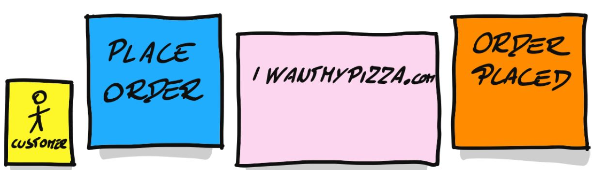

There's a lot of little **semantic** differences here: **Commands, Actions, and Decisions** are **similar concepts**, but they're definitely not the same thing. However, in **process modeling** game, it's more efficient to focus on the **visible traits** of a **Command** with an action written in the **present tense**.

**command** does not imply **completion**, **Events** will eventually contain **its outcome(s)**, but **commands** can still **fail** or be **rejected**.

#### People

They match with different concepts like **Users, Actors, Roles, Personas or even specific persons** with **name** and **surname**, we could get more specific than a simple *user* or *customer* if that helps the discussion.

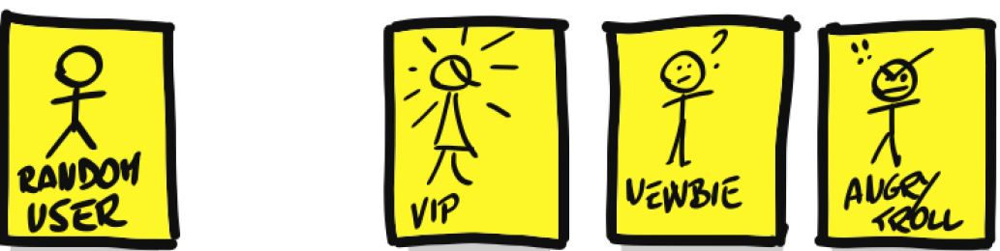

During the **exploration**, you might **discover** that different types of **people** have different **interests and motivations** in different steps:

- do the **same thing** but for **different reasons** like buying a train ticket for a job trip or for a holiday

- need **alternative** or extra steps in the **flow**, and the reason for **branching** depends on the **customer type**, like *New Customer* or *Returning Customer*

- do the **same thing** but they need **different information** to **start** or **complete** the **task**.

#### Internal users

When **designing processes**, much attention is usually devoted to external generating **revenue users** (e.g. *customers*) while **internal users** are usually mapped to their **roles**, but sometimes **internal users** may **expose** different **behavior** or **apply** different **principles**, a more in-depth look to **internal users behavior** may lead to interesting **discoveries** in the **problem space**.

#### Systems

While **modeling processes**, we may progressively need something more **sophisticated** than the original **definition** such as *'whatever we can blame'*, by looking for **inconsistencies and corner cases**, and we should progressively **inject precision** into our **discussion**.

**Generic systems?**
**participants** will try to make things **simple**, by making **systems** **generic**. We must resist and make every **specific** **system** **explicit**

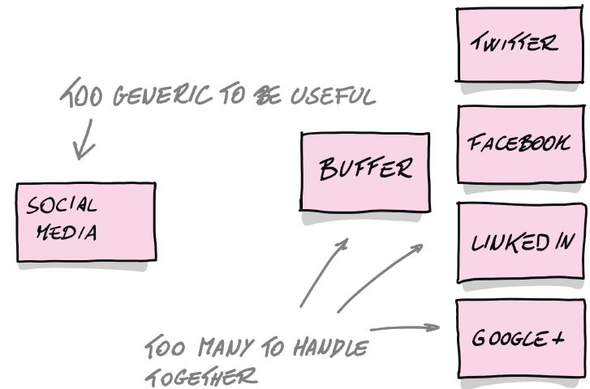

>> Different **systems** have different **strengths** and **pain points** and Generic systems don't. Sometimes displaying every system might **confusing**, it's usually a good idea to **pick** a **representative**, and use **HotSpots** for others.

##### Conversational Systems**

**Systems** like phones, email, chats can host a more human-friendly interaction, but conversational systems are somewhat harder to model in an event-driven fashion.

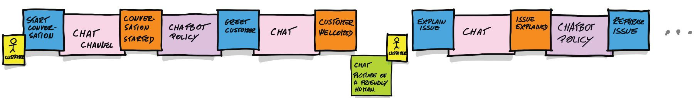

**Modeling a conversation** with **events** can take up a lot of **precious modeling space** without leading us **anywhere** (DO NOT script the conversation).

Often, we rely on Implicit **assumption** that we'll stay on the **conversational system** for a while until some **terminal event**.

**Focus on the outcome**

**Event-based** approach is not good fit when **intermediate steps** are **lost** in the **nuances** of **natural language**, we could use **termination condition**, or the final outcome of the conversation and ask the question *"What will make this conversation end?"*:

- Closing words like *goodbye*

- Goal of the conversation has been *accomplished*
 
- *This conversation is clearly going nowhere*

- **Embrace** the **perspective** of **downstream actors** : *"don't care how you reach the deal, I only care about the deal details"*

- also Looking at the **pivotal events** could help

#### Policies

**Policies** define organizational business process behavior, were people are performing tasks with an implicit or explicit agreement.

**Policies** capture the **reactive logic** of our **processes** : Whenever **[event(s)]** then **[command(s)]**

'**Whenever**' helps us highlight the expected system **reaction** whenever a given **event**, or a **combination of events** happen.

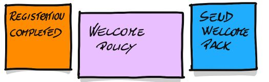

**Policies** answer the following questions : 

- *How is our system is supposed to react to given event(s)?*
- *and which command(s) is/are issued as a reaction's result to that event(s)?

**Policies** are **missing glue** between a **domain event** and the resulting **command**, there is always a **business decision** between an **event** and the **reaction**.

> Example of *Customer Support Policy*

>> "Whenever we receive a clarification request from a known customer, we try to answer or to open the conversation with the desired specialist within one working day."

A **policy** can also be seen as a **placeholder** for a **decision happening** in the **organization**, triggered by a given **event** (or **combination of events**). 

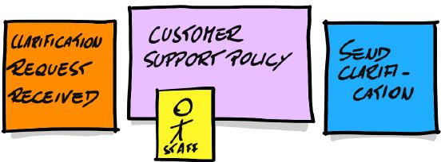

Sometimes this **reaction to an event** is **automatic**, other times it is managed by **people**. When this is the case, we place the relevant **person** (which could represent different stages of maturity of the company) on the corresponding **policy**.

**Policies** tend to be the **first** thing that needs to **change** when the **business context changes**. **Policies** are the flexible glue between the other building blocks of business processes.

**Discovering** the real **implementation** of an existing **policy** is an **investigation game**: people will not tell you the real **story** at **first** attempt. To get through this, **speak loudly** and use *whenever* ... *then* with a **combination** of **Always/Immediate** in a sentence.

**Example**
 
*Whenever we receive a room hold request, and always if the customer provided their full name and phone number, and there's room availability for the selected dates, immediately we just do it.*

Now, it looks like there are two **competing policies**, so let's **make** them **visible!**

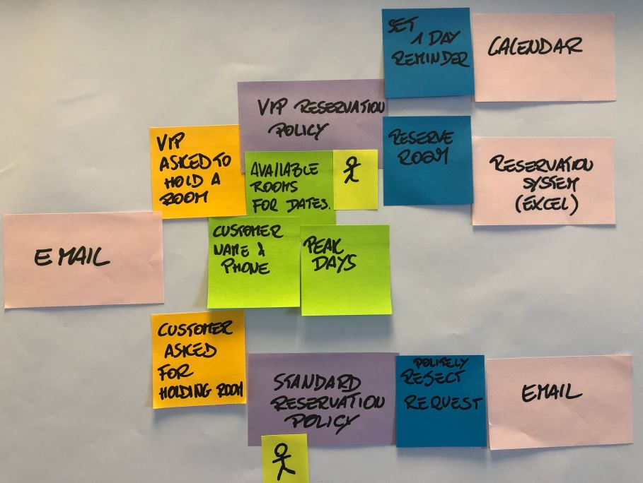
The resulting model, after we split the **policy** in two, and took care of the **open hotspots**.

#### Challenging value

In process modeling we are also challenging the **business narrative** (why we are doing this or that?), in way to find **inconsitencies** before even **writing software**.

Every step of the flow can **create** or **destroy** **value** for a given user, by:
- discovering **multiple currencies**, e.g. personal satisfaction, reputation, happiness, anxiety,...
- discovering **new opportunities**
- discovering **inconsistencies**

There is a need to streamline not only mechnical consitencies but also address people values in order to perform at organizational level. 

#### Read Models
**Read models** are the **information** that needs to be **available** for a **user** to take **decision** and to produce a **command**. 

We use **read models** to visualize **constraints** on the **data** that needs to be **available** to implement a **process**, but we use it also to **visualize** the **assumptions** behind the **decision-making process** and eventually **challenge** them. 

> We should **listen** to the **voice** of a **user** to fetch the **data** that he needs to make a **decision**. It might be that everything he **needs** is just a *voice-activated service running*.

Some implementation need **sequences**, and the sequence matters, but many times, **fetching data** is not a **process step**: it's a **piece** of one possible **solution** leaking into the **problem space**.

Sometimes, the list of relevant information such as **wireframes** and **sketches** is all you need to understand the **flow** but this is never the **whole story**.

**example**

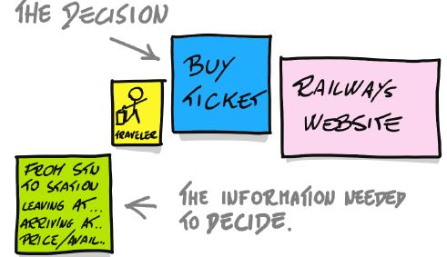

We can write the relevant **information** to support a user choice in a *green* **read model**

### Process modeling game strategies
Like in most **games**, being familiar with the **rules** is only the first step. The more we  play, the more we'll **shift** your **focus** from following the rules, into **developing** a more **sophisticated** set of **moves** that will allow you to **win** the **game**.

- add a little more **structure** than in Big Picture EventStorming by showing the **expected frame of a process modeling** session.

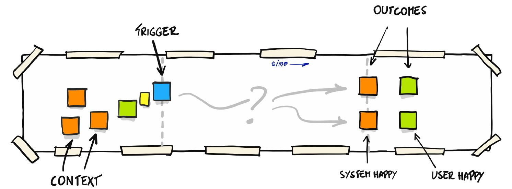

- Use **explicit walk-through**

- Use **reverse narratives**

- Make a little mess or run a **chaotic exploration** first, and then use the **notation** to connect the dots

#### Managing branches

Before starting the modeling session we might have the **illusion** that the **process** we're going to model should be approximately **linear**. 

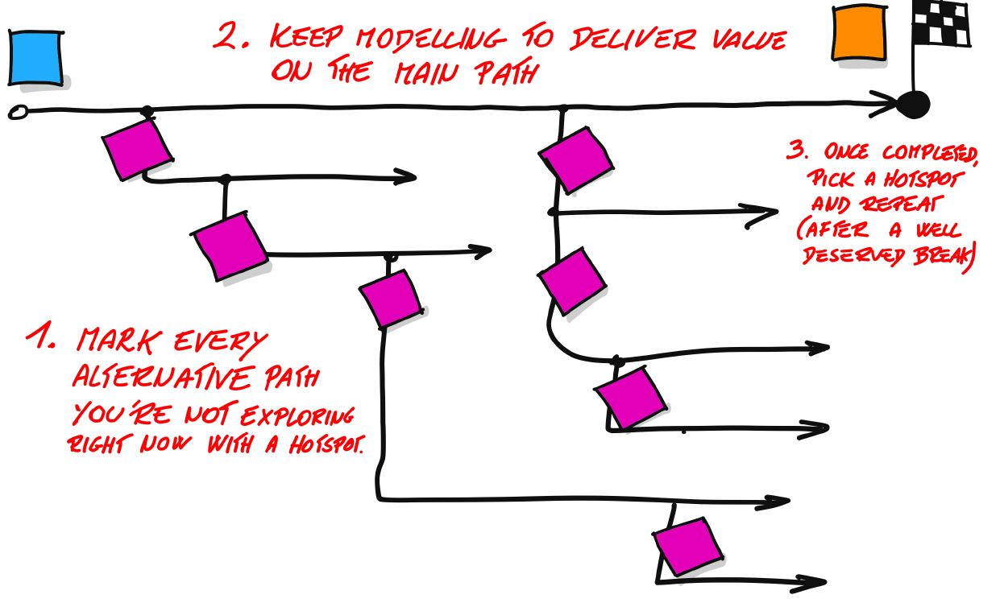

That's never the case, we should be prepared to handle a **continuous explosion of branches** and **alternatives** using **Hotspots** to **stop** long open branches **discussion**.

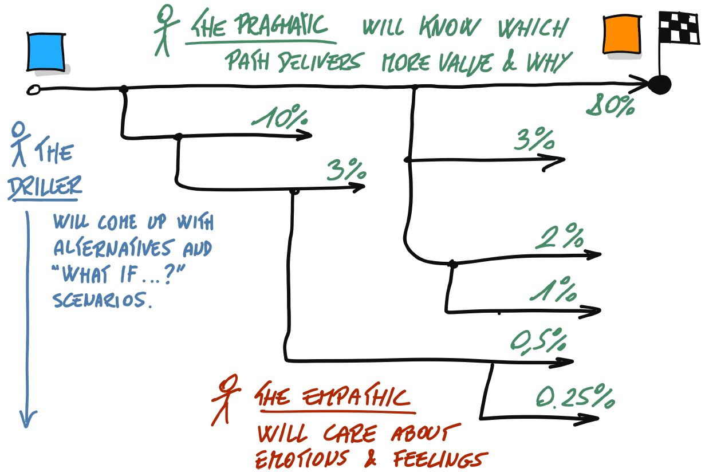

With Team dynamics we get **balancing personalities**, thanks to **different personalities and styles** which will play different **roles**, and each one of them is **precious!**

#### Split & Merge

Different **personalities** can have a hard time **working** together. There's a universe of possible reasons, coming from outside the modeling session, e.g. people **resisting** the whole idea of **designing a new process**, or *alpha-male* leaving no space for *dissent* or *different style of reasonings*.

We can **split teams** and attack the problem from two different **angles** (e.g. solo mode person before facing the rest with his model/thoughts). Using the same **notation**, it will be easier to **spot** parts which are very **similar** or **not** on both sides and then have an **educated discussion** to touch **different solutions** and make a more **informed choice**.

### Observing global state

> Banks are so worried about **eventual consistency**. But every time we *transfer money*, we see *money disappearing* in a *wormhole* and reappearing somewhere else a couple of *days later*.

**Business transaction** should be seen as a **process of reconciliation**, **filling** a **gap** between **current** and **desired state**. 

>> ordering a sandwich and paying like a 5 € banknote, waiting and not worrying about what if the guy take the 5 € banknote and not showing up.

A **Transaction** is just a **process**, we zoom into **business transactions**, we'll **discover** that they're **never atomic** but they're rather a **sequence of states** which are somewhat **inconsistent**. It's more to consistency than it's apparent to the eye.

## Software Design - running a Design-Level EventStorming

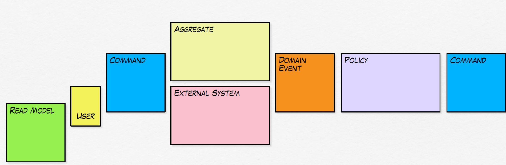

Color puzzle thinking
#### What do we do with the Big Picture Artifact?

- It contains a good enough **dictionary** of **domain events**.

- It highlights, usually as a **hotspot**, an indication of the **problem** we're trying to **solve**. 

- it shows the **current** level of **understanding** of the **external contexts** we're working with.

### Modeling Aggregates

They are defined as **units of transactional consistency**. They are **groups of objects** whose **state** can **change**, but that should **always** expose some **consistency** as a **whole**. This **consistency** is achieved **enforcing** given **invariants**, **properties** that should **always** be **true**, no matter what. 

e.g. the *amount subtotal* of selected *items* should reflect the **current status** of the *ShoppingCart*, i.e. The *ShoppingCart subtotal* will always be the **sum** of each article **quantity multiplied** by **unit price**, we adhere to **Always valid state** principle, i.e. **no way** to have **inconsistent reads** while accessing different **portions** of the **Aggregate**.

#### Discovering aggregates
Looking at the **data to be contained** get us into **data and the static structure trap**. i.e. it drives software stakeholders into **misleading agreements**: everybody would **pretend** to **agree** we need a **container** for the **data**, and the **data** will need to be **used** (or **reused**) in **many places**.

**Example of treacherous thinking process in action**: 
------------------------------------------------------
From a **data** perspective a **ShoppingCart** must be associated with a **Customer** which is not usually the case, a ShoppingCart will need to be associated with a **WebSession** instead which might be **associated** to an **authenticated User** or **not**! We'll need a Customer in order to create a valid Order starting from the ShoppingCart, and this would force the current Users to log in if they started adding items in some anonymous session.

A **ShoppingCart** will include the **list** of the **items** to be **purchased**, with the associated **quantity** and **price**.
Do we need really to include the *ItemDescription* in the ItemInCart? Feels like we should, because we'll need to display the **ShoppingCart** info to the **customer**, in order to **review** the **cart** before proceeding to **checkout**, *"is this really the stuff we  intended to buy? Have we looked at the grand total?"*. Things might get awkward when starting to consider events like *ItemPriceUpdated* or *ItemDescriptionUpdated*, that should have us thinking whether we should include a **copy** of the entire **description** of the selected **item**, or just a **reference** to the **Item** in stock.

**The bottom line** is, these are not the **Aggregates** we're looking for. "data to be displayed to a user in order to make a decision" will be a **Read Model**. **Aggregates** are something else, but we have to be aware of this **vicious temptation** of **superimposing** what we need to **see** on the **screen** on the **internal structure** of our **model**. **They're not the same thing**.

To **discover aggregate** (don't use the name aggregate) we could use the following :

- Look for **responsibilities** first what is this yellow sticky responsible for? Which are the system's expectation towards it? 

- Look for the **information** needed in order to **fulfill** this **responsibility**. 

- Once this is sorted out, ask yourself, e.g. **"How would I call a class with this information and purpose?"**.

#### Aggregates as state machines

We are **looking for** **units** of **consistent behavior**, we should spot a kind of **state machine logic**, which focuses on **behavior** not on the **DATA** :   

- The **key content** of an **aggregate** is the **bit of information** triggering **behavior** by the **event**. 
- Additional **content** as **redundant information** which get **propagated** through **events** from other **bounded context**.
- The role of **Aggregate** in the flow is a litte local decision to **accept** or **reject** a **command** based on **its internal state**.

>> given all the corporate dysfunctions we might not expect **consistency** to scale much.

We have to **postpone** the **Aggregate naming** because it will diverge a discussion to produce multiple perspectives and to prevent an implicit early consensus.

#### Modeling interactions with Event-Driven CRC cards

**Class Responsability Collaborator (CRC)** Cards are an object oriented design technique, where **teams** can use to **discuss** what a **class** should **know** and do and what **other classes** it **interacts** with.

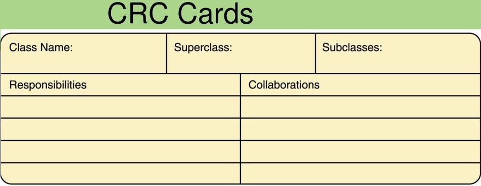

**Name** : class name

**Responsibility** : what a **class does** as well as what **information** you wish to **maintain** about it, often **identify** a **responsibility** for a class to **fulfill** a **collaboration** with another class.

**Collaboration**: Some responsibilities will **collaborate** with one or more other classes to **fulfill** one or more **Scenarios**.
 
 - A class often does not have **sufficient information** to fulfill its **responsibilities**. Therefore, it must **collaborate** (work) with other classes to get the **job done**.
 
 - **Collaboration** will be in one of two forms: a **request for information** or a **request to perform a task**
 
 - To **identify** the **collaborators** of a class for each **responsibility** ask the question **"does the class have the ability to fulfill this responsibility?"**. If **not** then look for a **class** that either has the **ability** to **fulfill** the **missing functionality** or the **class** which should **fulfill** it. In doing so you'll often **discover** the **need** for **new responsibilities** in other classes and maybe even the **need** for a **new class** or **two**.

**Design starts** to focus around **roles**, **responsibilities** and **message passing**, a very efficient way to model interaction is to simulate **behavior** with a **variation** of the **CRC cards**.

- Humans may take the **role** of **Users**, **Aggregates**, **Processes** and **Projections**, i.e. humans are representing the decision makers in the system. 

- **Commands, Domain Events and UIs** are represented by **cards**. Cards will carry the information written on them. To model a process, every human can produce an output only based on the information available, i.e. humans can't ask, only tell, this sketches the necessary communication patterns needed for a component to work smoothly and continuously in an event-based solution.

#### How do we know we're over?

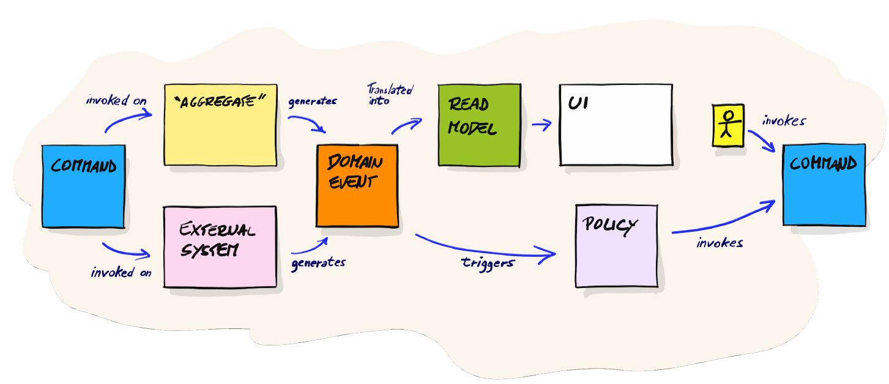

Once flattened, this is what we're **expecting** in a **consistent flow**.

We should have a **symmetry** between **events** and **commands** (which is trivial - a verbs in present tense followed by verbs in past tense), most **importantly** we should investigate why some are **lacking symmetries** (might be some **concepts** are **missing** or **conflicting**!).

>> The bottom line is **"merge the people, split the software"**.